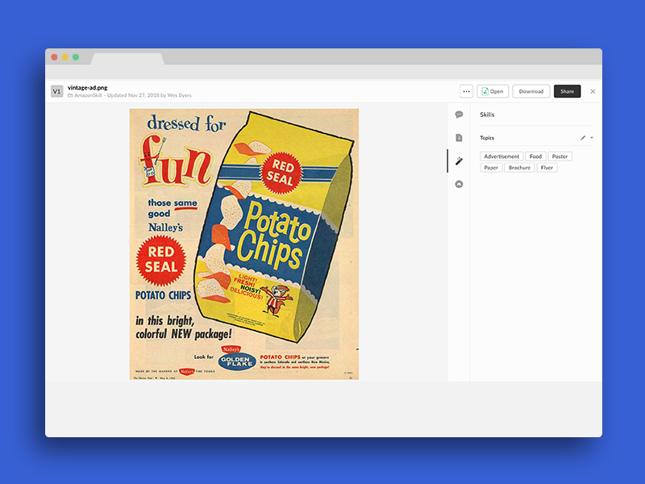

# Amazon Rekognition Label Extraction 

Use the Amazon [Rekognition API](https://aws.amazon.com/rekognition/) to automatically extract labels for images and add them to your image files as metadata.



Amazon Rekognition makes it easy to add image and video analysis to your applications. In this sample we use the [DetectLabels](https://docs.aws.amazon.com/rekognition/latest/dg/API_DetectLabels.html) endpoint to detect the real-world objects present in images. The Rekognition API detects objects, events, or concepts that are present in the image provided.

## Usage

### Prerequisites

* Make sure to sign up for a [AWS](https://aws.amazon.com) account.
* Make sure to sign up for a [Box Developer](https://developer.box.com/) account and prepare your app for Box skills. See our [developer documentation](https://developer.box.com/docs/box-skills) for more guidance. 

### Skill user permissions

Finnaly, ensure that you have added the right permissions to your AWS identity who will be executing the Skill. For this sample to work your user needs access to the Rekognition services. You can find these settings in the Identity Access Managment (IAM) portal in the AWS console.

The permissions for this user should look similar to the code below to ensure access to Rekognition has been granted.

```json
{
  "Version": "2012-10-17",
  "Statement": [
    {
        "Effect": "Allow",
        "Action": [
            "rekognition:*"
        ],
        "Resource": "*"
    }
  ]
}
```

## Configuring Serverless

Our Box skills uses the excellent [Serverless framework](https://serverless.com/). This framework allows for deployment to various serverless platforms, but in this example we will use AWS as an example.

To use Serverless, install the NPM module.

```bash
npm install -g serverless
```

Next, follow our guide on [configuring Serverless for AWS](../AWS_CONFIGURATION.md), or any of the guides on [serverless.com](https://serverless.com/) to allow deploying to your favorite serverless provider.

### Deploying

Clone this repo and change into the Rossum folder.

```bash
git clone https://github.com/box-community/sample-document-skills
cd sample-document-skills/amazon-rekognition-labels-detection
```

Then, deploy the Skill.

```bash
serverless deploy -v
```

At the end of this, you will have an invocation URL for your Lambda function. 

### Set the invocation URL

The final step is to [configure your Box Skill with the invocation URL](https://developer.box.com/docs/configure-a-box-skill) for your Lambda function. You should have received this in the previous, after you deployed the function for the first time.

Once your new skill is called by our code, the Skill usually takes around a few minutes to process and write the new metadata to the file.

## Frequently Asked Questions

### Who might use this Skill?

Business processes that rely on uploading large amounts of images and sorting / classifying these images could benefit greatly from using this skill.

### What types of files does this Skill handle?

This skill can handle `.JPG`, and `.PNG` image files 

### What metadata is written back to my Box file?

Concepts, objects, and events detected in each image file that is uploaded will be supplied as metadata on the image once the skill has finished running. For examples of specific data that is returned, please refer to the screenshots folder in this repo.

### What implications does this have for my business?

Using Box with AWS Rekognition services can greatly reduce the time needed to classify large amounts of images. Employees time spent going through large amounts of images tagging relevant information can be greatly reduced
