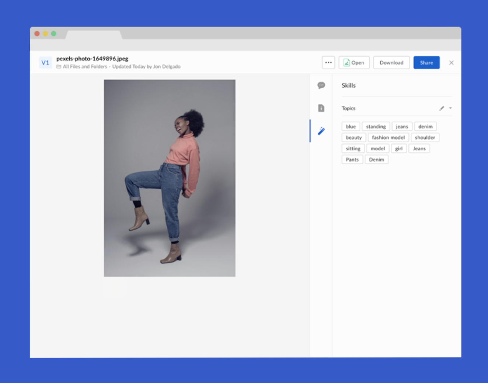

#Google Vision Box Skill
Use [Google Vision](https://cloud.google.com/vision/) to automatically extract metadata from a clothing retailer catalog picture and add the metadata to content managed in Box.



## ##Usage

###Prerequisites
[Install Node.js (we recommend v8.0 or above)](https://nodejs.org/en/)
[Install Serverless](https://serverless.com/framework/docs/getting-started/)
[Set up a Google Cloud account](https://cloud.google.com/)
Sign up for a [Box Developer](https://developer.box.com/) account and prepare your app for Box skills. See our [developer documentation](https://developer.box.com/docs/box-skills) for more guidance.

###Configuring Serverless
Our Box Skill uses the excellent [Serverless framework](https://serverless.com/). This framework allows for deployment to various serverless platforms.
To use Serverless, install the NPM module.

```
npm install -g serverless
```

Next, create a Google Cloud Function. follow Serverless has a great [step-by-step guide](https://serverless.com/framework/docs/providers/google/guide/quick-start/) you could follow if needed.

Clone this repo and change into the folder.

```
git clone https://github.com/box-community/sample-image-skills
```

Finally, deploy the Skill.

```
serverless deploy -v
```

At the end of this, you will have an invocation URL for your Lambda function.

###Set the invocation URL
The final step is to [configure your Box Skill with the invocation URL](https://developer.box.com/docs/configure-a-box-skill) for your serverless function. You should have received this in the previous, after you deployed the function for the first time.

Once your new Skill is called by our code, the Skill usually takes a few minutes to process and write the new metadata to the file.

## ##Frequently Asked Questions

###Who might use this Skill?
If you have ever manually tag big collections of images to easily identify what’s in them and make it easier to search, then this Skill might be for you. Particularly if your collection is of a product inventory and brand assets are part of a workflow. Much of this manual data entry can now be automated.

###What types of files does this Skill handle?
This skill can images with the following extensions:

- bmp
- png
- tiff, tif
- jpeg, jpg

###What metadata is written back to my Box file?
The skills populates metadata around the content of an image:

- Description (e.g. denim)
- Confidence score (e.g. 0.9683345)

###What implications does this have for my business?
Using Box with Google Vision has the potential to eliminate enormous amounts of manual data entry and tagging by using automated image scanning process with high levels of accuracy. The addition of metadata can make these images more searchable in Box.
