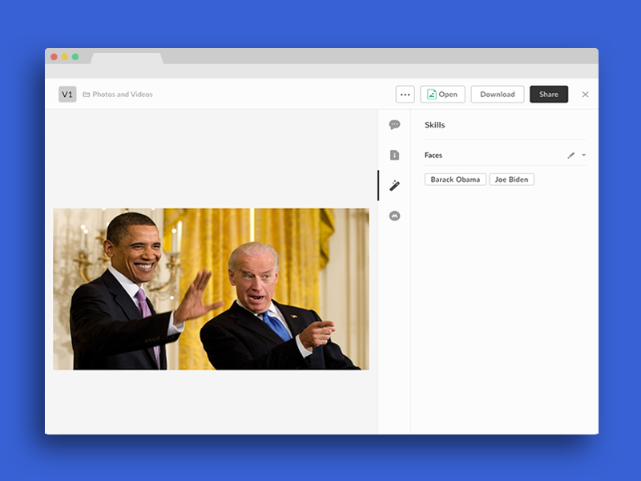

# Hive Predict Face Recognition

This is a simple, generic example of a custom face recognition Box Skill for images using the [Box Skills Kit](https://github.com/box/box-skills-kit-nodejs)
and the [Hive Predict API](https://thehive.ai/docs#hive-predict-api).



## Usage

### Prerequisites

Hive offers image classification as a service, and can provide a custom model that is trained to classify faces for your specific use case. To get started,

1) [Sign up](https://thehive.ai/signup) for a free Hive account.
2) [Contact Hive](https://thehive.ai/contact-us) to set up a trial access to a pretrained model API endpoint.

For more info on Hive's API, please refer to their [documentation](https://thehive.ai/docs#hive-predict-api). 

### Configuring Serverless

Our Box skills uses the excellent [Serverless framework](https://serverless.com/). This framework allows for deployment to various serverless platforms, but in this example we will use AWS as an example.

To use Serverless, install the NPM module.

```bash
npm install -g serverless
```

Next, follow our guide on [configuring Serverless for AWS](../AWS_CONFIGURATION.md), or any of the guides on [serverless.com](https://serverless.com/) to allow deploying to your favorite serverless provider.

### Deploying

Clone this repo and change into the sample folder.

```bash
git clone https://github.com/box-community/sample-image-skills
cd sample-image-skills/hive-predict-face-recognition
```

Then change the `HIVE_API_ENDPOINT` and `HIVE_API_KEY` environment variables in your `serverless.yml` file to your Hive API key and endpoint URLs.

```yaml
...

functions:
  index:
    ...
    environment:
      HIVE_API_ENDPOINT: YOUR_HIVE_API_ENDPOINT
      HIVE_API_KEY: YOUR_HIVE_API_KEY
```

Finally, deploy the Skill.

```bash
serverless deploy -v
```

At the end of this, you will have an invocation URL for your Lambda function. 

### Set the invocation URL

The final step is to [configure your Box Skill with the invocation URL](https://developer.box.com/docs/configure-a-box-skill) for your Lambda function. You should have received this in the previous, after you deployed the function for the first time.

Once your new skill is called by our code, the Skill usually takes around a few minutes to process and write the new metadata to the file.
